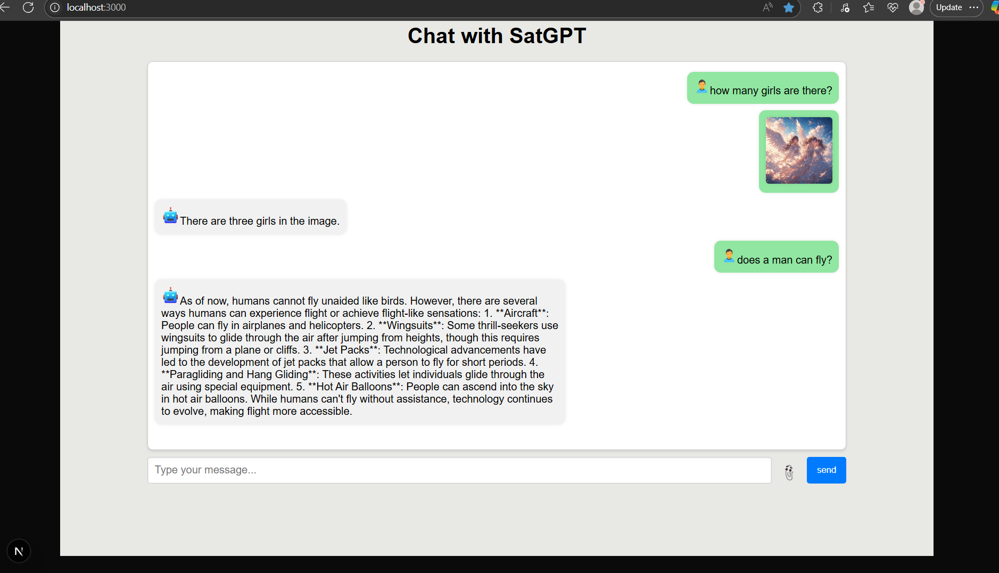

# AI_Chat_App

OpenAI API based Chat Application, where the users can query through text or upload an image and query a question releated to that image.

## Getting Started in local

First, run the development server:

```bash
npm i
npm run dev
```

Open [http://localhost:3000](http://localhost:3000) with your browser to see the result.

## Reference screenshot


